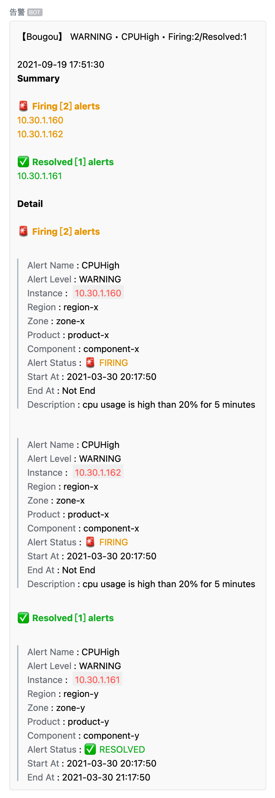
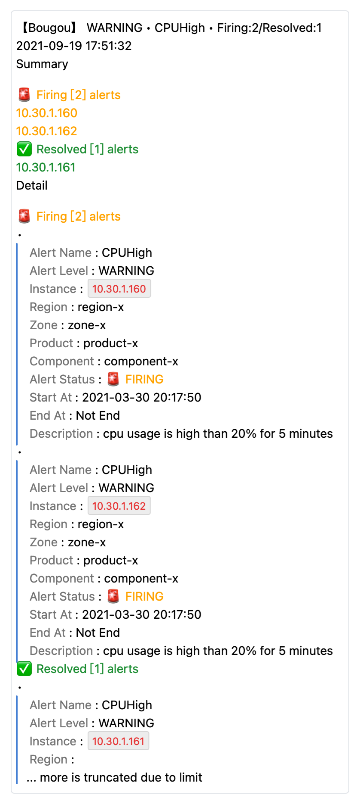
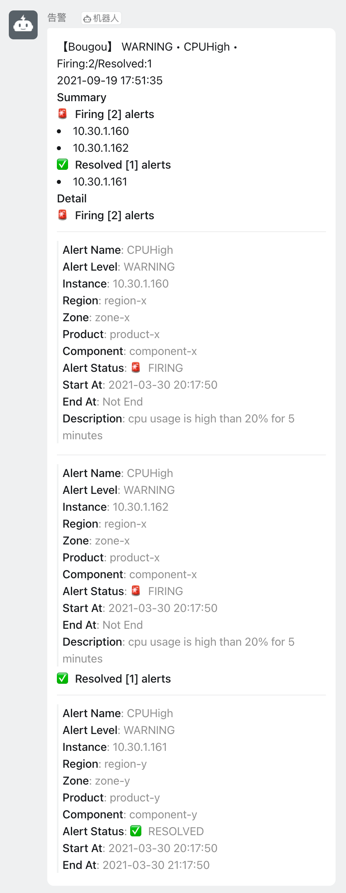
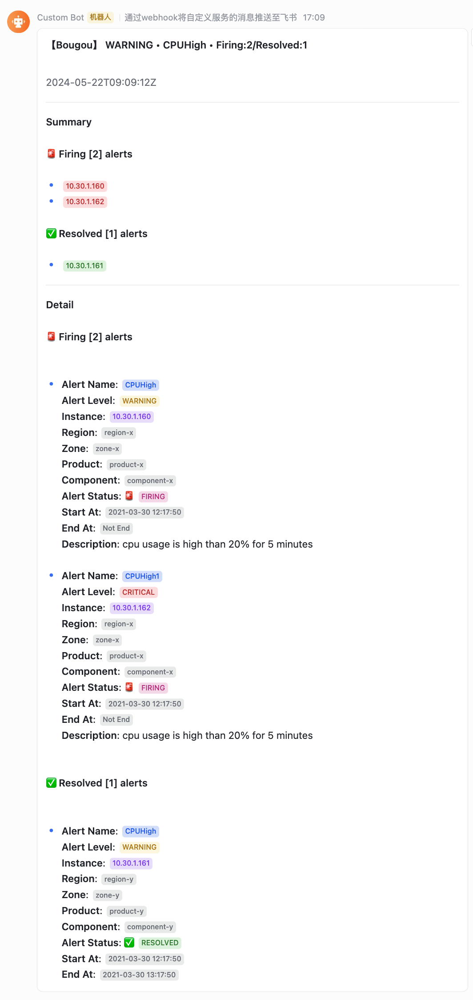
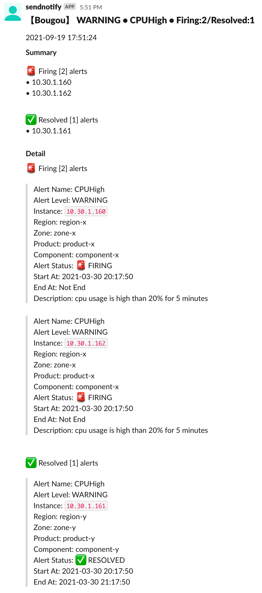

# alertmanager-webhook-adapter

A general webhook server for receiving [Prometheus AlertManager](https://prometheus.io/docs/alerting/latest/configuration/#webhook_config)'s notifications and send them through different channel types.


## Supported Notification Channels

- `weixin`, Weixin Group Bot / 企业微信群机器人

  ```
  http(s)://{this-webhook-server-addr}/webhook/send?channel_type=weixin&token={token}
  ```

- `dingtalk`, Dingtalk Group Bot / 钉钉群机器人

  ```
  http(s)://{this-webhook-server-addr}/webhook/send?channel_type=dingtalk&token={token}
  ```

- `feishu`, Feishu Group Bot / 飞书群机器人

  ```
  http(s)://{this-webhook-server-addr}/webhook/send?channel_type=feishu&token={token}
  ```

- `weixinapp`, Weixin Application / 企业微信应用

  ```bash
  # Must specify one of to_user, to_party, to_tag parameter
  http(s)://{this-webhook-server-addr}/webhook/send?channel_type=weixinapp&corp_id={corp_id}&agent_id={agent_id}&agent_secret={agent_secret}&to_user={user_id}&to_party={party_id}&to_tag={tag_id}

  # to_user 指定接收消息的成员，成员 ID 列表（多个接收者用 '|' 分隔，最多支持 1000 个）
  # 指定为 "@all"，则向该企业应用的全部成员发送

  # to_party 指定接收消息的部门，部门 ID 列表，多个接收者用 '|' 分隔，最多支持 100 个
  # 当 to_user 为 "@all" 时忽略本参数

  # to_tag 指定接收消息的标签，标签 ID  列表，多个接收者用 '|' 分隔，最多支持 100 个
  # 当 to_user 为 "@all" 时忽略本参数
  ```

- `slack`, Slack App

  ```
  http(s)://{this-webhook-server-addr}/webhook/send?channel_type=slack&token=<token>&channel=<channel>
  ```

- `discord-webhook`, Discord Webhook

  ```bash
  http(s)://{this-webhook-server-addr}/webhook/send?channel_type=discord-webhook&id={id}&token={token}

  # discord webhook url:
  # https://discord.com/api/webhooks/{id}/{token}
  # https://discord.com/api/webhooks/12673xx/adruxxx
  ```

> More is comming...

## Run

### Build and Run

```bash
$ cd cmd/alertmanager-webhook-adapter
$ go build -v -x

$ ./alertmanager-webhook-adapter

# see help
$ ./alertmanager-webhook-adapter -h

# Add signature for sent messages
$ ./alertmanager-webhook-adapter --listen-address=:8060 --signature "Anything-You-Like"
# the signature will be added to the beginning of the message:
# 【Anything-You-Like】this-is-the-xxxxxxxxxx-message
```

### Start as systemd service

```bash
# Install the binary alertmanager-webhook-adapter file to some directory
# like /usr/local/bin/alertmanager-webhook-adapter
# and chmod +x /usr/local/bin/alertmanager-webhook-adapter

$ cp deploy/alertmanager-webhook-adapter.service /etc/systemd/system/

# make sure the bin path to be consistent
# ExecStart=
$ vim /etc/systemd/system/alertmanager-webhook-adapter.service

$ systemctl daemon-reload
$ systemctl start
```

### Run as Docker container

```bash
# expose the host port (127.0.0.1:8090) to container port (8090)
docker run --rm -it -p 127.0.0.1:8090:8090 bougou/alertmanager-webhook-adapter:v1.1.8

docker run --rm -it -p 127.0.0.1:8090:8090 bougou/alertmanager-webhook-adapter:v1.1.8 --signature MyIDC --lang zh --debug
```

### Run in K8S

Apply manifests:

```bash
cd deploy/k8s
kubectl apply -f deployment.yaml
kubectl apply -f service.yaml
```

Or Deploy with Helm

```bash
# prepare custom values.yaml
# see: https://github.com/bougou/alertmanager-webhook-adapter/blob/main/deploy/charts/alertmanager-webhook-adapter/values.yaml
vim values.yaml

helm repo add bougoucharts https://bougou.github.io/charts
helm repo update

helm upgrade alertmanager-webhook-adapter \
  bougoucharts/alertmanager-webhook-adapter \
  --install \
  --namespace infra \
  --version v1.0.0 \
  --values values.yaml
```

## Configure Alertmanager to send alert messages to this webhook server

```yaml
- name: 'sre-team'
  webhook_configs:
  - url: "http://10.0.0.1:8090/webhook/send?channel_type=weixin&token=1234-1234-1234"
```

## Command

```
$ ./alertmanager-webhook-adapter -h
alertmanager-webhook-adapter

Usage:
  alertmanager-webhook-adapter [flags]

Flags:
  -h, --help                    help for alertmanager-webhook-adapter
  -l, --listen-address string   the address to listen (default "0.0.0.0:8090")
  -s, --signature string        the signature (default "未知")
  -n, --tmpl-default string     the default tmpl name
  -d, --tmpl-dir string         the tmpl dir
      --tmpl-lang string        the language for template filename
  -t, --tmpl-name string        the tmpl name
```

## Builtin Templates Notification Screenshots

- [Chinese](./docs/screenshot-zh.md)

| WeixinGroupBot                                | WeixinApp                                        | DingTalkGroupBot                                | FeishuGroupBot                                |
| --------------------------------------------- | ------------------------------------------------ | ----------------------------------------------- | --------------------------------------------- |
|  |  |  |  |

| Slack App                                    |
| -------------------------------------------- |
|  |

## Custom Templates

The project already has builtin templates for all supported notification channels.
But you can use your own template file(s) to override those defaults.

You can use the following three options.

-  `--tmpl-dir (-d)`
-  `--tmpl-name (-t)`
-  `--tmpl-default (-n)`

The `--tmpl-dir` is a MUST if you want to load your custom templates. `--tmpl-name` and `--tmpl-default` is optional. So, there are THREE use cases when combining those options.

1. `--tmpl-dir <somepath>`
2. `--tmpl-dir <somepath> --tmpl-name <tmplname>`
3. `--tmpl-dir <somepath> --tmpl-default <tmplname>`

> If `--tmpl-name` and `--tmpl-default` are both specified, `--tmpl-default` will be ignored.

These three use cases are used for different purposes.

### `--tmpl-dir`

> **Purpose**: Use different template files for different channels

First, create a dir to store your template files, like `templates`. And then put your template files under the template dir.

The program will **try to search `<channel>.tmpl` files** under the tmpl dir for all supported channels,
and use the founded file as the template for the corresponding channel. If not found, use builtin template.

```bash
$ touch templates/feishu.tmpl
$ touch templates/weixin.tmpl

# use templates/feishu.tmpl for feishu channel
# use templates/weixin.tmpl for weixin channel,
# use builtin templates for other channels.
$ ./alertmanager-webhook-adapter -s Bougou --tmpl-dir ./templates/
```

### `--tmpl-dir` and `--tmpl-name`

> **Purpose**: Use one custom template for all channels.

Create your own template file, like `custom.tmpl`, and put it under the template dir.
The filename with suffix removed will be the template name and be used as value of the `--tmpl-name` parameter.

The program will **try to search `<tmplName>.tmpl` file** under the tmpl dir.
The selected tmpl file will be used for all notification channels. If not found, error and exit.

```bash
# use templates/custom.tmpl for all channels.
$ ./alertmanager-webhook-adapter -s Bougou --tmpl-dir ./templates/ --tmpl-name custom
```

### `--tmpl-dir` and `--tmpl-default`

> **Purpose**: Use different template files for only several channels, and use an extra template file for all other channels.

```bash
$ touch templates/feishu.tmpl
$ touch templates/weixin.tmpl

$ touch templates/default.tmpl

# use templates/feishu.tmpl for feishu channel
# use templates/weixin.tmpl for weixin channel,
# use templates/default.tmpl for other channels.
$ ./alertmanager-webhook-adapter -s Bougou --tmpl-dir ./templates/ --tmpl-default default
```

### Template Content

The template file should use an [`AlertmanagerWebhookMessage`](./pkg/models/alert.go) object as the input data.

```go
type AlertmanagerWebhookMessage struct {
	Version         string           `json:"version"`
	GroupKey        *json.RawMessage `json:"groupKey"`
	TruncatedAlerts int              `json:"truncatedAlerts"`

	Status            string `json:"status"`
	Receiver          string `json:"receiver"`
	Alerts            Alerts `json:"alerts"`
	GroupLabels       KV     `json:"groupLabels"`
	CommonLabels      KV     `json:"commonLabels"`
	CommonAnnotations KV     `json:"commonAnnotations"`
	ExternalURL       string `json:"externalURL"`

	MessageAt time.Time `json:"messageAt"` // the time the webhook message was received
	Signature string    `json:"signature"` // 签名，如发送短信时出现在内容最前面【】
}
```

All template files MUST define the following template parts in the template file.

- `prom.title`
- `prom.text`
- `prom.markdown`

## Language for template files

When loading template files, the program defaults to try to load files with name `<channelName>.tmpl` or `<tmplName>.tmpl` or `<tmplDefault>.tmpl`.

But you can specify the option `--tmpl-lang <lang>` to change the loading rule.

If `--tmpl-lang <lang>` is specified, **and the specified lang is NOT equal to `en`**, the program will try to load files with name `<channelName>.<lang>.tmpl` or `<tmplName>.<lang>.tmpl` or `<tmplDefault>.<lang>.tmpl`.
If `<lang>` equals to `en`, the default loading rule is NOT changed.

The `<lang>` can be any string, just make sure it matches your desired file names.

This project already builtin supports two languages, `en` for english, `zh` for chinese. It defaults to `en` if `--tmpl-lang` is not specified.

> The `--tmpl-lang` only impacts which files will be loaded, it does not care the contents of the files.

## How AlertInstance is determined?

The default notification templates will try its best to print the alert instance information for each alert.
The alert instance is determined from the labels of the alerts.

The following labels of the alerts are sought by priority order and selected as "alert instance" if the label is found.

- `alertinstance`
- `instance`
- `node`
- `nodename`
- `host`
- `hostname`
- `ip`

In prometheus, most metrics may provide `instance`, or `node` or `ip` label, but its value may not be suitable for alert information. Then, I recommend to use
the following two methods to add an extra `alertinstance` label when writing alert rules.

1. Use PromQL function [`label_join`](https://prometheus.io/docs/prometheus/latest/querying/functions/#label_join), eg:

    ```yaml
    - alert: KubePodCrashLooping
      expr: label_join(max_over_time(kube_pod_container_status_waiting_reason{reason="CrashLoopBackOff", job="kube-state-metrics", namespace=~".*"}[5m]) >= 1, 'alertinstance', '/', 'namespace', 'pod')
      for: 15m
      labels:
        severity: warning
      annotations:
        description: 'Pod {{ $labels.namespace }}/{{ $labels.pod }} ({{ $labels.container }}) is in waiting state (reason: "CrashLoopBackOff").'
        summary: Pod is crash looping.
    ```

2. (Preferred) Directly add `alertinstance` label, eg:

    ```yaml
    - alert: KubePodCrashLooping
      expr: max_over_time(kube_pod_container_status_waiting_reason{reason="CrashLoopBackOff", job="kube-state-metrics", namespace=~".*"}[5m]) >= 1
      for: 15m
      labels:
        severity: warning
        alertinstance: '{{ $labels.namespace }}/{{ $labels.pod }}'
      annotations:
        description: 'Pod {{ $labels.namespace }}/{{ $labels.pod }} ({{ $labels.container }}) is in waiting state (reason: "CrashLoopBackOff").'
        summary: Pod is crash looping.
    ```
