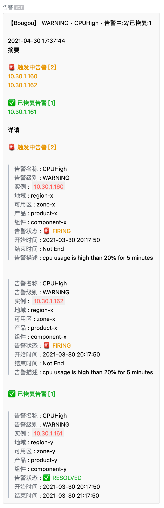
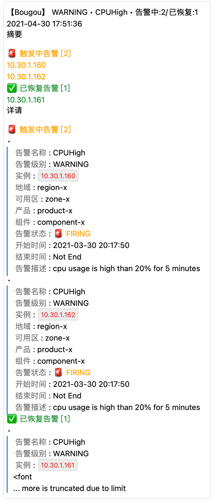

# alertmanager-webhook-adapter

A general webhook server for receiving [Prometheus AlertManager](https://prometheus.io/docs/alerting/latest/configuration/#webhook_config)'s notifications and send them through different channel types.


## Supported Notification Channels

- `weixin`, Weixin Group Bot / 企业微信群机器人
    ```
    http(s)://<this-webhook-server-addr>/webhook/send?channel_type=weixin&token=<token>
    ```
- `dingtalk`, Dingtalk Group Bot / 钉钉群机器人
    ```
    http(s)://<this-webhook-server-addr>/webhook/send?channel_type=dingtalk&token=<token>
    ```
- `feishu`, Feishu Group Bot / 飞书群机器人
    ```
    http(s)://<this-webhook-server-addr>/webhook/send?channel_type=feishu&token=<token>
    ```
- `weixinapp`, Weixin Application / 企业微信应用
    ```
    http(s)://<this-webhook-server-addr>/webhook/send?channel_type=weixinapp&corp_id=<corp_id>&agent_id=<agent_id>&agent_secret=<agent_secret>
    ```

> More is comming...

## Run

### Build and Run

```bash
$ cd cmd/alertmanager-webhook-adapter
$ go build -v -x

$ ./alertmanager-webhook-adapter

# see help
$ ./alertmanager-webhook-adapter -h

# Add signature for sent messages
$ ./alertmanager-webhook-adapter --listen-address=:8060 --signature "Anything-You-Like"
# the signature will be added to the begining of the messsage:
# 【Anything-You-Like】this-is-the-xxxxxxxxxx-message
```

### Start as systemd service

```bash
# Install the binary alertmanager-webhook-adpater file to some directory
# like /usr/local/bin/alertmanager-webhook-adapater
# and chmod +x /usr/local/bin/alertmanager-webhook-adapater

$ cp deploy/alertmanager-webhook-adapter.service /etc/systemd/system/

# make sure the bin path to be consistent
# ExecStart=
$ vim /etc/systemd/system/alertmanager-webhook-adapter.service

$ systemctl daemon-reload
$ systemctl start
```

## Configure Alertmanager to send alert messages to this webhook server

See **Features** section.

```yaml
- name: 'sre-team'
  webhook_configs:
  - url: "http://10.0.0.1:8090/webhook/send?channel_type=weixin&msg_type=markdown&token=1234-1234-1234"
```

## Custom Templates

The project already has builtin templates for all supported notifiction channels.
But you can use your own template file(s) to override those defaults.

You can use the following three options to acheive this purpose.

-  `--tmpl-dir (-d)`
-  `--tmpl-name (-t)`
-  `--tmpl-default (-n)`

The `--tmpl-dir` is a MUST if you want to load your custom templates. `--tmpl-name` and `--tmpl-default` is optional. So, there are THREE use cases when combining those options.

1. `--tmpl-dir <somepath>`
2. `--tmpl-dir <somepath> --tmpl-name <tmplname>`
3. `--tmpl-dir <somepath> --tmpl-default <tmplname>`

> If `--tmpl-name` and `--tmpl-default` are both specified, `--tmpl-default` will be ignored.

These there use cases are used for different purposes.


### `--tmpl-dir`

> **Purpose**: Use different template files for different channels

First, create a dir to store your template files, like `templates`. And then put your template files under the template dir.

The program will **try to found `<channel>.tmpl` files** under the tmpl dir for all supported channels,
and use the founded file as the template for the corresponding channel. If not found, use builtin template.

```bash
$ touch templates/feishu.tmpl
$ touch templates/weixin.tmpl

# use templates/feishu.tmpl for feishu channel
# use templates/weixin.tmpl for weixin channel,
# use builtin templates for other channels.
$ ./alertmanager-webhook-adapter -s Bougou --tmpl-dir ./templates/
```

### `--tmpl-dir` and `--tmpl-name`

> **Purpose**: Use one custom template for all channels.

Create your own template file, like `custom.tmpl`, the filename without suffix will be the template name, and put it under the template dir.

The program will **try to found `<tmplName>.tmpl` file** under the tmpl dir. The choosed tmpl file will be used for all notification channels. If not found, error and exit.

```bash
# use templtes/custom.tmpl for all channels.
$ ./alertmanager-webhook-adapter -s Bougou --tmpl-dir ./templates/ --tmpl-name custom
```

### `--tmpl-dir` and `--tmpl-default`

> **Purpose**: Use different template files for only several channels, and use an extra template file for all other channels.

```bash
$ touch templates/feishu.tmpl
$ touch templates/weixin.tmpl

$ touch templates/default.tmpl

# use templates/feishu.tmpl for feishu channel
# use templates/weixin.tmpl for weixin channel,
# use templates/default.tmpl for other channels.
$ ./alertmanager-webhook-adapter -s Bougou --tmpl-dir ./templates/ --tmpl-default default
```

### Template Content

The template file should use an [`AlertmanagerWebhookMessage`](./pkg/models/alert.go) object as the input data.

```go
type AlertmanagerWebhookMessage struct {
	Version         string           `json:"version"`
	GroupKey        *json.RawMessage `json:"groupKey"`
	TruncatedAlerts int              `json:"truncatedAlerts"`

	Status            string `json:"status"`
	Receiver          string `json:"receiver"`
	Alerts            Alerts `json:"alerts"`
	GroupLabels       KV     `json:"groupLabels"`
	CommonLabels      KV     `json:"commonLabels"`
	CommonAnnotations KV     `json:"commonAnnotations"`
	ExternalURL       string `json:"externalURL"`

	MessageAt time.Time `json:"messageAt"` // the time the webhook message was received
	Signature string    `json:"signature"` // 签名，如发送短信时出现在内容最前面【】
}
```

All template files MUST define the following template parts in the template file.

- `prom.title`
- `prom.text`
- `prom.markdown`


## Builtin Templates Notification Screenshots

| 企业微信机器人                              | 企业微信应用                                   | 钉钉群机器人                                  | 飞书群机器人                                |
| ------------------------------------------- | ---------------------------------------------- | --------------------------------------------- | ------------------------------------------- |
|  |  |  |  |
